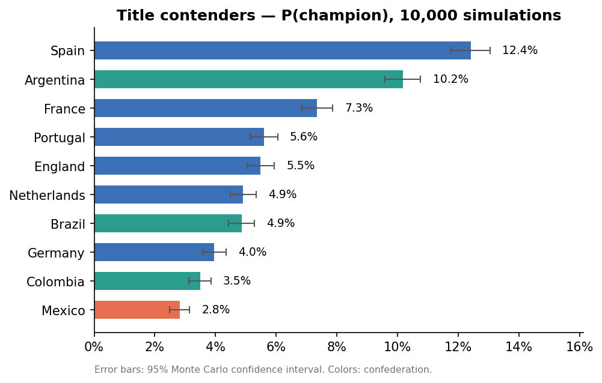

# ⚽ FIFA World Cup 2026 — Winner Prediction Engine

> Elo ratings + machine learning + 10,000 Monte Carlo tournaments of the
> official 48-team format — built end-to-end, with 90+ tests.

  

<p align="center"></p>

**Live dashboard:** _[add your Streamlit Cloud link]_ · **Pre-tournament predictions locked:** tag `v1.0-pre-tournament`

## What this is

A complete prediction system for the 2026 FIFA World Cup (the first 48-team
edition), built as a portfolio demonstration of the full data science
lifecycle: acquisition → cleaning → feature engineering → modeling →
simulation → visualization → deployment. **Not** a betting tool.

## Headline results

| Team | P(champion) | P(final) | P(semis) |
|---|---|---|---|
| Spain | 12.4% | 19.8% | 29.4% |
| Argentina | 10.2% | 16.0% | 24.6% |
| France | 7.3% | 12.7% | 22.2% |

*10,000 simulated tournaments; ±0.7pp Monte Carlo noise at this sample size.
Full 48-team table: [`results/simulation_summary.csv`](results/simulation_summary.csv).*

## How it works

```
raw matches (47k, 1872–present) ─► cleaning pipeline (audited, 8 validation gates)
        ─► chronological Elo engine (tournament-weighted K, MOV-scaled)
        ─► leakage-safe features (long-format shift(1) pattern, 18 features)
        ─► XGBoost W/D/L classifier  +  Poisson scoreline GLM (Dixon–Coles)
        ─► Monte Carlo over the official 2026 bracket
           (12 groups → best-8 thirds via constraint matching ≡ FIFA Annex C
            → R32 → ... → Final, ET + penalties modeled)
        ─► probabilities, figures, Streamlit dashboard
```

Three details I'm proud of:
- **Leakage is structurally impossible**, not just avoided: every rolling
  feature passes through one `shift(1)`, and a test flips a match result and
  asserts that match's own features don't move.
- **All 495 third-place scenarios** of the new format are exhaustively tested
  against the constraint rules FIFA's Annex C encodes.
- **Honest uncertainty**: every probability ships with its Monte Carlo
  confidence interval.

## Quickstart

```bash
git clone https://github.com/<you>/world-cup-2026-prediction
cd world-cup-2026-prediction
pip install -r requirements.txt

# data (needs ~/.kaggle/kaggle.json)
python -m src.data.download
python -m src.data.clean

# simulate + figures + dashboard
python -m examples.simulate_2026
python -m examples.make_figures
streamlit run dashboard/app.py

pytest -q        # 93 tests
```

## Repository map

```
src/data/         download, cleaning pipeline, name normalization
src/features/     Elo engine, feature builder
src/models/       XGBoost/RF/logistic harness, Poisson goal model
src/simulation/   bracket config, fast MC engine, OO tournament model
src/visualization plots (matplotlib + plotly)
dashboard/        Streamlit app
tests/            93 tests incl. leakage proof & 495-scenario check
examples/         runnable demos for every component
reports/figures/  generated charts
results/          simulation outputs, metrics
```

## Evaluation

Time-ordered split only (train < 2018-06, test = 2018+2022 World Cup era);
TimeSeriesSplit CV for tuning; metrics: log loss (primary), Brier, accuracy
vs a class-priors baseline. See `reports/` for the backtest write-up.

## Limitations (honest list)

Demo Elo estimates until the pipeline runs on refreshed data · penalties
≈ coin flip · fair-play tiebreaker approximated by drawing of lots · Poisson
independence patched (Dixon–Coles) but not eliminated · no injuries/lineups.

## Data sources & credits

Match results: Mart Jürisoo (Kaggle, CC0) · FIFA rankings: cashncarry
(Kaggle, CC0) · Elo methodology: eloratings.net conventions · Bracket:
official FIFA 2026 schedule. Built with pandas, scikit-learn, XGBoost,
Plotly, Streamlit.

## License

MIT
